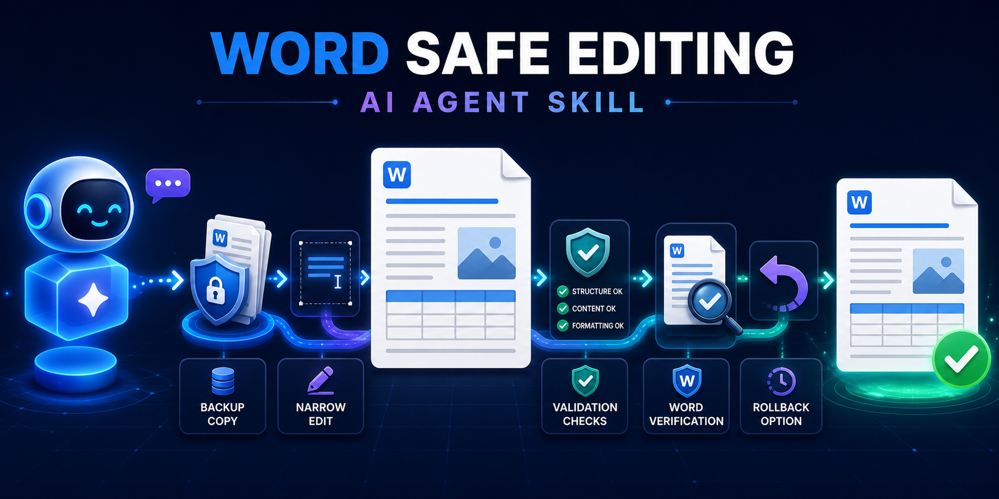
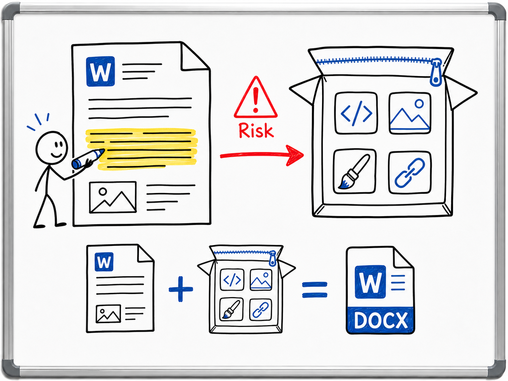
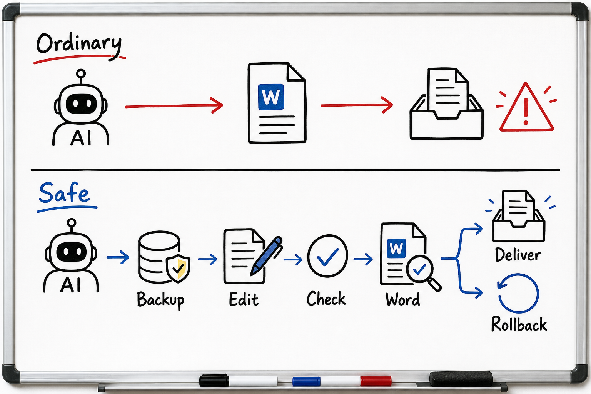
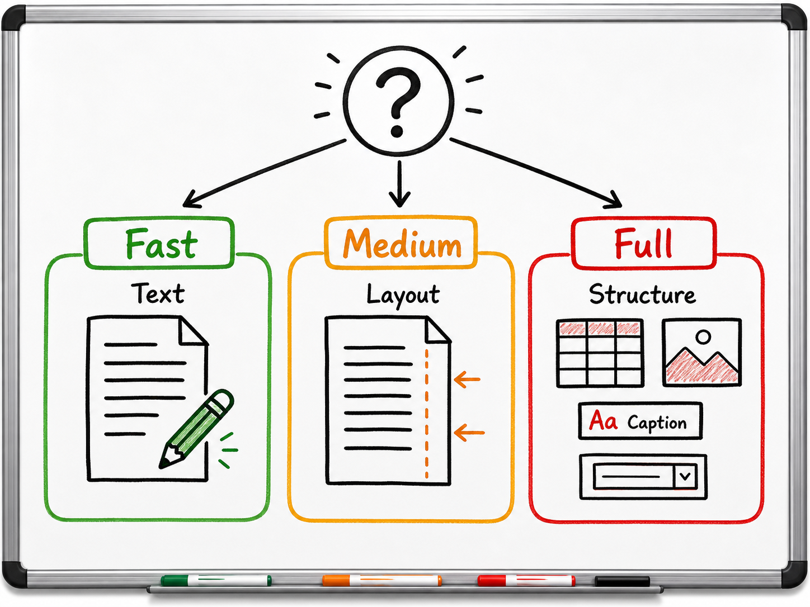
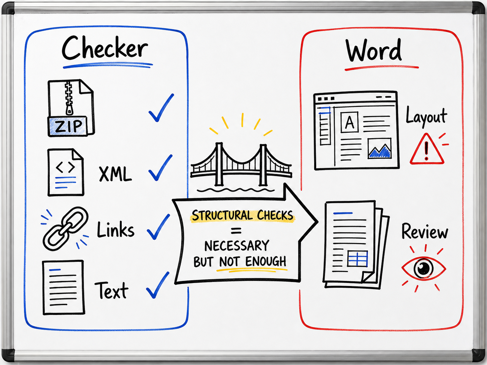
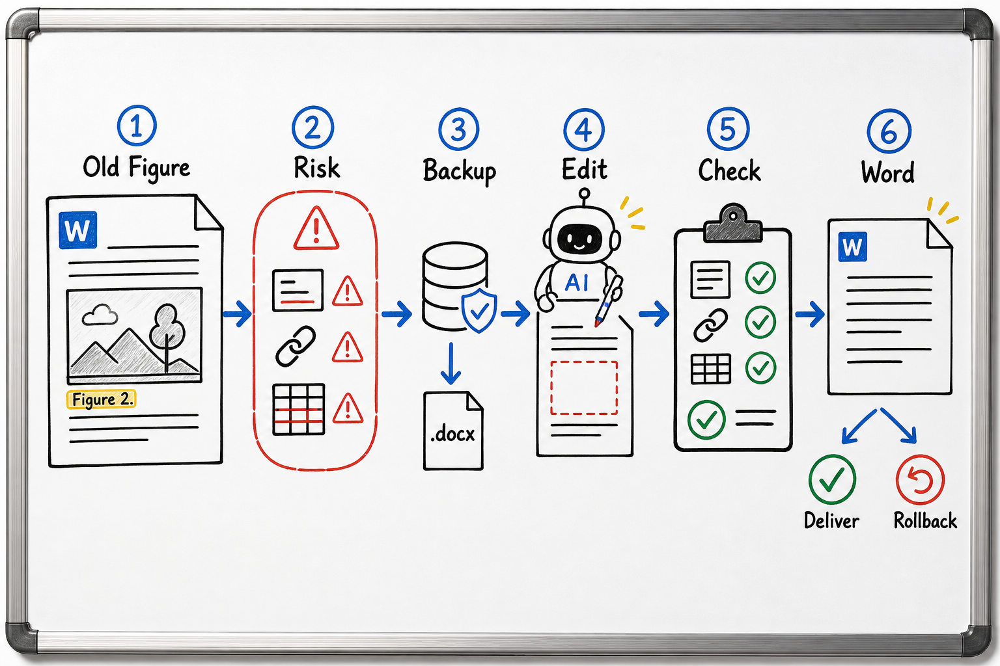

<strong>A safety skill for AI agents editing existing Microsoft Word documents.</strong> 
It teaches the agent when to back up, when to edit narrowly, what to check, and when to roll back.

<em>Reduces editing risk; it does not guarantee zero document damage.</em>

## What problem does it solve?

A DOCX file is not one simple page. It is a ZIP package of XML files, media, styles, captions, links, fields, and relationships. An AI edit can look correct in text while breaking the package behind the page.

This project adds safety rules for Codex-style agents and a deterministic checker that can catch many structural mistakes before a damaged document reaches the user.

## What changes when the skill is installed?

Without this skill, an agent may treat a Word file like plain text. With this skill, the agent follows a recoverable workflow: classify risk, make a backup, edit the smallest safe area, run structural checks, verify in Microsoft Word, then deliver or roll back.

## How does the agent choose the safety level?

The skill uses three protection levels. The key question is not "how many words changed?" but "what could the edit disturb?"

- **Fast:** tiny text-only changes far from tables, images, fields, and page edges.
- **Medium:** longer wording, page-end paragraphs, highlighted text, or figure-adjacent text.
- **Full:** tables, images, captions, numbering, fields, comments, styles, page structure, or any Word repair warning.

## What can the checker prove?

The checker is useful because it is deterministic, read-only, and repeatable. It is also limited: it can check package structure and requested text conditions, but it cannot prove visual layout or Word's final pagination.

## Worked example

Example task: remove an outdated figure from Section 3 without leaving a stale caption, blank table row, or broken image relationship.

The important part is the control flow: the edit is not considered finished just because the target text changed. It is finished only after the surrounding document structure still passes the selected checks.

## Install with your AI agent

If you already use Codex or another local AI coding agent, you usually do not need to type the commands yourself. Ask your agent:

~~~text
Install this Codex skill from GitHub:
https://github.com/ChrisZhangWG/word-safe-editing-ai-agent-skill

Copy skill/word-safe-editing into my local Codex skills folder,
then tell me when to restart Codex.
~~~

After restarting Codex, ask naturally:

~~~text
Please update the conclusion in this Word report without changing
its formatting, images, comments, or pagination.
~~~

Or explicitly invoke <code>$word-safe-editing</code>.

## Manual install fallback

If you prefer to install it yourself:

~~~bash
git clone https://github.com/ChrisZhangWG/word-safe-editing-ai-agent-skill.git
cp -R word-safe-editing-ai-agent-skill/skill/word-safe-editing ~/.codex/skills/
~~~

Then restart Codex.

## Ask your agent to run the checker

The checker is a helper for your AI agent. It checks DOCX package structure, required text, forbidden text, broken relationships, and selected media/caption risks before the agent delivers an edited file.

Ask your agent:

~~~text
After editing the Word document, run the DOCX safety checker from this skill.
Check that the revised text is present, the old text is gone, and there are no obvious broken media relationships.
Explain the result in plain language before giving me the final document.
~~~

Passing the checker means the selected structural checks passed. It does not replace visual QA or Microsoft Word open/save verification.

Technical users can also run `skill/word-safe-editing/scripts/check_docx_safety.py` directly.

## Scope, privacy, and safety

Version 0.1 targets **Codex + macOS + Microsoft Word + existing DOCX files**. Legacy DOC, encrypted or protected documents, and macro-enabled files are not fully supported. Tests use only fictional temporary fixtures. Do not publish real private documents as examples.

## License

[MIT License](LICENSE) (c) 2026 Chris Zhang.
