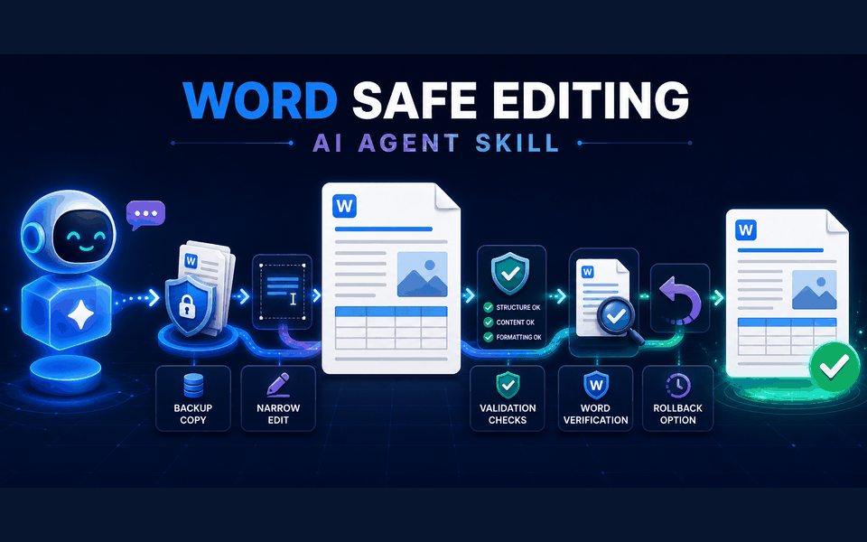
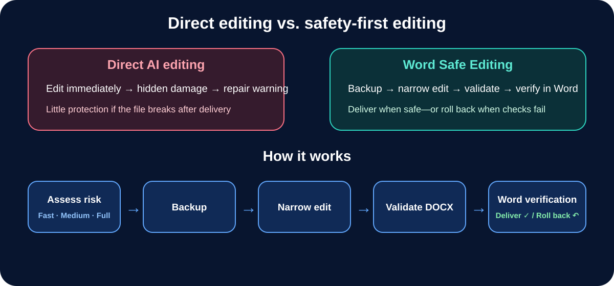
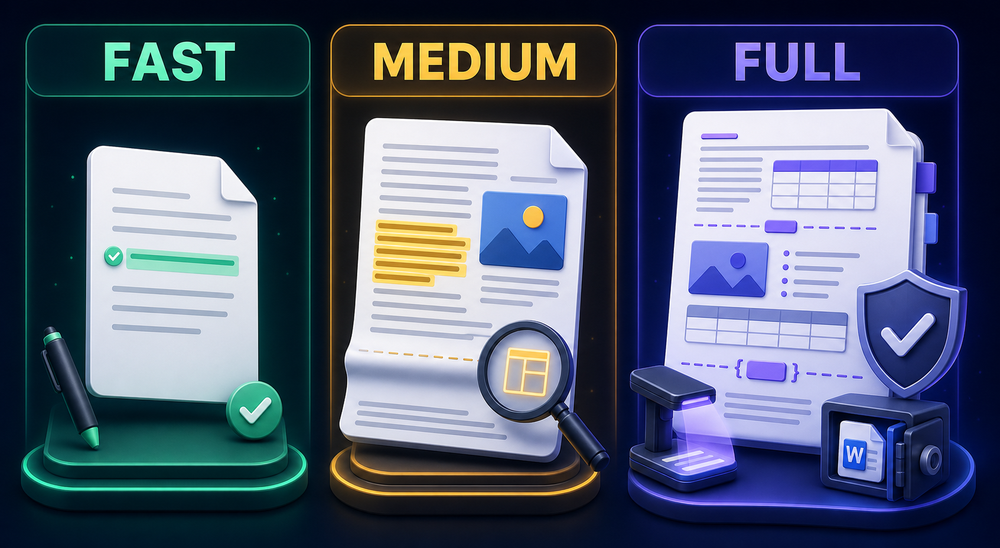

<strong>Edit existing Word documents with AI agents—more safely.</strong> 
Backup, narrow edits, deterministic DOCX checks, Microsoft Word verification, and rollback.

<em>Reduces editing risk; it does not guarantee zero document damage.</em>

## 15-second visual tour

## Why this skill exists

Direct AI editing can appear successful while damaging formatting, tables, images, or internal relationships. This skill adds recoverability and verification before delivery.

## The safety workflow

## Install in three steps

~~~bash
git clone https://github.com/ChrisZhangWG/word-safe-editing-ai-agent-skill.git
cp -R word-safe-editing-ai-agent-skill/skill/word-safe-editing ~/.codex/skills/
~~~

Restart Codex, then ask naturally:

~~~text
Please update the conclusion in this Word report without changing
its formatting, images, comments, or pagination.
~~~

Or explicitly invoke <code>$word-safe-editing</code>.

## What the agent does

1. Assesses the edit as Fast, Medium, or Full risk.
2. Creates a recoverable backup.
3. Makes the narrowest safe edit.
4. Validates ZIP, XML, relationships, and requested content boundaries.
5. Verifies the document opens and saves in Microsoft Word.
6. Delivers the result—or rolls back if verification fails.

## Three levels of protection

- **Fast:** small text-only changes with low layout risk.
- **Medium:** longer wording, page-edge content, highlights, or figure-adjacent text.
- **Full:** tables, images, captions, fields, page structure, formatting, or recent Word errors.

## Run the DOCX safety checker

~~~bash
python3 skill/word-safe-editing/scripts/check_docx_safety.py report.docx \\
  --must-contain "Revised conclusion" \\
  --must-not-contain "Old conclusion" \\
  --warn-unreferenced-media
~~~

The checker is read-only and uses only Python's standard library. A zero exit status means the selected structural checks passed; it does not replace visual QA or Word verification.

## Scope, privacy, and safety

Version 0.1 targets **Codex + macOS + Microsoft Word + existing DOCX files**. Legacy DOC, encrypted or protected documents, and macro-enabled files are not fully supported. Tests use only fictional temporary fixtures. Do not publish real private documents as examples.

## License

[MIT License](LICENSE) © 2026 Chris Zhang.
